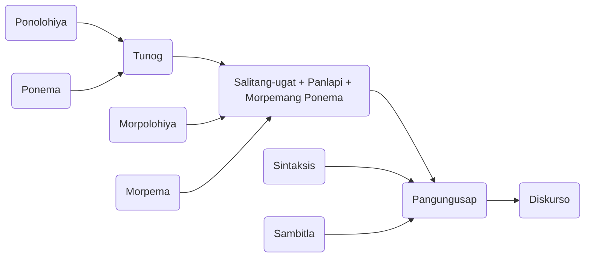

---
title:
tags: SPS 🇵🇭
toc: true
season: summer
---

# A.  Wika, Katuturan at Katangian
Ang wika ay maaaring tumutukoy sa kakayahan ng tao na mag-angkin at gumamit ng mga komplikadong sistemang pangkomunikasyon, o sa ispesipikong pagkakataon ng nasabing komplikadong sistemang pangkomunikasyon. Bilang isang pangkalahatang konsepto, ang wika ay tumutukoy sa kognitibong pakulti na nagbibigay-kakayahan sa mga tao upang matuto at gumamit ng mga sistema ng komplikadong komunikasyon (Wikipedia). Bilang isang ispesipikong lingguwistik na konsepto, ang wika ay tumutukoy sa mga tiyak na lingguwistik na sistema na ang kabuuan ay pinangalanan ng tiyak na katawagan tulad ng Ingles, Pranses, Aleman, Nihonggo, Mandarin, Filipino, at iba pa.

Ang humigit-kumulang sa 3,000 hanggang 6,000 mga wika na sinasalita ng mga tao sa kasalukuyan ang pinakamahuhusay na halimbawa ng wika bilang isang ispesipikong lingguwistik na konsepto, ngunit ang natural na wika ay maaari ring nakabatay sa mga biswal na istimulus liban pa sa mga awditibong istimulus, katulad halimbawa ng pasulat na wika at sign language. Ang mga koda at iba pang uri ng artipisyal na likhang sistemang pangkomunikasyon tulad ng ginagamit sa *computer programming* ay tinatawag ding wika.

Ang salitang Ingles na *language* ay mula sa salitang Latin na *lingua* na ibig sabihin ay dila. Ang metaporikal na relasyon ng wika at dila ay umiiral sa maraming wika at patunay ito sa historikal na pagkaprominente ng sinasalitang wika.

Ang mga eksperto sa wika ay may kani-kaniyang pagpapakahulugan sa wika bilang isang pangkalahatang konsepto man o bilang isang ispesipikong lingguwistik na konsepto. Pansinin at talakayin natin ang ilan sa mga ito.

Ayon kay Webster (1974), *ang wika ay isang sistema ng komunikasyon sa pagitan ng mga tao sa pamamagitan ng mga pasulat o pasalitang simbolo*.

Ayon naman kay Hill (sa Tumangan, et al., 2000) sa kanyang papel na *What is Language?*, *wika ang pangunahin at pinakaelaboreyt na anyo ng simbolikong gawaing pantao.* Ang mga simbolong ito ay binubuo ng mga tunog na nalilikha ng aparato sa pagsasalita at isinasaayos sa mga klase at patern na lumilikha sa isang komplikadao at simetrikal na estraktura. Ang mga simbolong ito ay mayroon ding kahulugang arbitraryo at kontrolado ng lipunan.

Halos gayon din ang kahulugang ibinigay ni Gleason (sa Tumangan, et al., 2000) sa wika. Ayon sa kanya, *ang wika ay masistemang balangkas ng sinasalitang tunog na pinipili at isinasaayos sa paraang arbitraryo upang magamit ng mga taong kabilang sa isang kultura.*

Mula sa mga katuturang nabanggit, mahahango natin ang mga pangunahin at unibersal na katangian ng wika na tatalakayin sa mga sumusunod na talataan:

1. **Ang wika ay masistemang balangkas.** Lahat ng wika sa daigdig ay sistematikong nakasaayos sa isang tiyak na balangkas. Walang wika ang hindi nakaayon sa balangkas na ito. Lahat ng wika ay nakabatay sa tunog. Ponema ang tawag sa makahulugang tunog ng isang wika samantalang Ponolohiya naman ang tawag sa makaagham na pag-aaral ng mga ito. Kapag ang mga ponemang ito ay pinagsama, maaaring makabuo ng maliit na yunit ng salita na tinatawag na morpema. Ang morpemang mabubuo ay maaaring isang salitang-ugat, panlapi o morpemang ponema katulad ng ponemang /a/ na sa wika natin ay maaaring magpahiwatig ng kasariang pambabae. Morpolohiya naman ang tawag sa makaagham na pag-aaral ng mga morpema. Samantala, kapag ang mga salita ay ating pinag-ugnay, maaari naman tayong makabuo ng mga pangungusap. Sintaksis naman ang tawag sa makaagham na pag-aaral ng mga pangungusap ang dalawa o higit pang tao ay nagkakaroon na ng tinatawag na diskurso. Aling wika ang hindi sumusunod sa balangkas na ito? Mayroon bang nalilikhang mga salita nang walang tunog? Maaari bang magkaroon ng diskurso anang walang pangungusap? 

1. **Ang wika ay sinsalitang tunog.** Hindi lahat ng tunog ay wika sapagkat hindi lahat ng tunog ay may kahulugan. Sa tao, ang pinakamakahulugang tunog na nililikha natin at kung gayo'y kasangkapan ng komunikasyon sa halos lahat kung hindi man lahat ng pagkakataon ay ang tunog na sinasalita. Samakatuwid, ito ang mga tunog na nalilikha ng ating aparato sa pagsasalita na nagmumula sa hanging nanggagaling sa baga o ang pinanggagalingang lakas o enerhiya, nagdaraan sa pumapalag na bagay na lumilikha ng tunog o artikulador at mino-*modify* ng resonador.

![[Pasted image 20210801142054.png]]

Bawat wika ay may kanya-kanyang set ng mga makahulugang tunog o ponema. Makahulugan ang isang tunog sa isang wika kapag ito ay nagtataglay ng kahulugan o di kaya'y may kakayahang makapagbago ng kahulugan ng isang morpema o salita.

Ang wikang Filipino ay may dalawampu't isang ponemang napapangkat sa dalawa - mga ponemang katinig at mga ponemang patinig. Ang mga ponemang katinig ay mailalarawan sa pamamagitan ng puno ng artikulasyon o kung saang bahagi isinasagawa ang pagbigkas ng ponema at sa paraan ng artikulasyon o paraan ng pagpapalabas ng hangin sa pagbigkas ng ponema at kung ang paraan ng artikulasyon ng bawat isa ay may tunog o walang tunog.

Samantala, ang mga ponemang patinig naman ay mailalarawan sa pamamagitan ng posisyon ng dila sa pagbigkas ng mga ito at sa kung saang bahagi ang dila nagaganap ang pagbigkas ng bawat isa.

TSART NG MGA PONEMANG KATINIG (SANTIAGO, 2003)

![[Pasted image 20210801142111.png]]

3. **Ang wika ay pinipili at isanasaayos.** Sa lahat ng pagkakataon, pinipili natin ang wikang ating gagamitin. Madalas, ang pagpili ay nagaganap sa ating *subconscious* at magkaminsan ay ating *conscious* na pag-iisip. Bakit lagi nating pinipili ang wikang ating gagamitin? Ang sagot: Upang tayo'y maunawaan ng ating kausap. Hindi maaaring ipagpilitan nating gamitin ang isang wikang hindi nauunawaan ng ating kausap. Gayon din ang ating kausap, hindi niya maaaring ipagpilitan ang wikang hindi natin batid. Tayo, ang ating kausap o ang pareho ay kailangang pumili ng komong wika kung saan tayo magkakaunawaan. Samantala, upang maging epektibo naman ang komunikasyon, kailangang isaaayos natin ang paggamit ng wika. Sa paggamit nito, kailangang isaalang-alang natin ang ilang mga konsiderasyon matatalakay pa nang higit sa kabanata V.

4. **Ang wika ay arbitraryo.** Kung ipinapalagay na ang wika ay arbitraryo, ano ang paliwanag sa pahayag na ito? Ayon kay Archibald A. Hill (sa Tumangan, et al., 2000), *just that the sounds of speech and their connection with entities of experience are passed on to all members of any community by older members of that community.* Kung gayon, ang isang taong walang paanong ang mga naninirahan sa komunidad na iyon ay nagsasalita sapagkat ang esensya ng wika ay panlipunan. Ngunit, samantalang ang bawat komunidad ay nakabubuo ng mga sariling pagkakakilanlan sa paggamit ng wika na ikinaiiba nila sa iba pang komunidad, bawat indibiduwal ay nakadedebelop din ng sariling pagkakakilanlan sa pagsasalita na ikinaiiba niya sa iba pa, sapagkat bawat indibiduwal ay may sariling katangian, kakayahan at kaalamang hindi maaaring katulad ng sa iba. *After all, no two individuals are exactly alike.*

5. **Ang wika ay ginagamit.** Ang wika ay kasangkapan sa komunikasyon at katulad ng iba pang kasangkapan, kailangang patuloy itong ginagamit. Ang isang kasangkapang hindi na ginagamit ay nawawalan na ng saysay, hindi ba? Gayon din ang wika. Idagdag pa na kapag ang wika ay hindi na ginagamit, ito ay unti-unting mawawala at tuluyang mamamatay. Ano ang saysay ng patay na wika? Wala. 

6. **Ang wika ay nakabatay sa kultura.** Paanong nagkaiba-iba ang mga wika sa daigdig? Ang sagot, dahil sa pagkakaiba-iba ng mga kultura ng mga bansa at mga pangkat. Ito ang paliwanag kung bakit may mga kaisipan sa isang wika ang walang katumbas sa ibang wika sapagkat wala sa kultura ng ibang wika ang kaisipang iyon ng isang wika. Pansinin natin ang pagkakaiba ng Ingles at Filipino. Ano-ano ang iba't ibang anyo ng *ice formations* sa Ingles? Ano ang katumbas ng mga iyon sa Filipino? Maaaring *yelo* at *nyebe* lamang. Ngunit ano ang katumbas natin sa iba pa? Wala, sapagkat hindi naman bahagi ng ating kultura ang *glacier, icebergs, frost, hailstorm* at iba pa. Samantala, ano naman ang katumbas sa Ingles ng ating *palay, bigas at kanin?* *Rice* lamang, hindi ba? Bakit limitado ang bokabularyong Ingles sa pagtutumbas ng mga salitang kargado ng kulturang agrikultural? Ang sagot, hindi iyon bahagi ng kanilang kultura.

7. **Ang wika ay nagbabago.** Dinamiko ang wika. Hindi ito maaaring tumangging magbago. Ang isang wikang *stagnant* ay maaari ring mamatay tulad ng hindi paggamit niyon. Paano nagbabago ang wika? Ang isang wika ay maaaring nadaragdagan ng mga bagong bokabularyo. Bunga ng pagiging malikhain ng mga tao, maaaring sila ay nakalilikha ng mga bagong salita. Ang pinakamahusay na halimbawa nito ay ang mga salitang balbal at pangkabataan. Samantala, kailangan ding lapatan ng mga katawagan ang mga produkto ng pag-unlad ng teknolohiya at syensya. Bunga nito, ang ating wika ay nadaragdagan ng mga bagong salita na hindi umiiral noon. May mga salita ring maaaring nawawala na sapagkat hindi na ginagamit. Samantala, may mga salita namang nagkakaroon ng bagong kahulugan. Halimbawa, ano ang mga orihinal na kahulugan ng salitang *bata?* Sa ngayon, ano-ano ang iba pa niyong bagong kahulugan? Ang mga iyan ay mga patunay na ang wika ay nagbabago.

# B. Barayti at Rehistro ng Wika
Bahagi ng metalingguwistik na pag-aaral ng wika ang pagkilala sa mga barayti nito.

Ang pagkakaroon ng barayti ng wika ay ipinapaliwanag ng teoryang sosyolingugwistik na pinagbatayan ng ideya ng pagiging *heterogenous* ng wika. Ayon sa teoryang ito, nag-uugat ang mga barayti ng wika sa pagkakaiba-iba ng mga indibiduwal at grupo, maging ng kani-kanilang tirahan, interes, gawain, pinag-aralan at iba pa. Samakatuwid, may dalawang dimensyon ang baryabilidad ng wika - ang dimensyong heograpiko at dimensyon sosyal. (Constantino, 2006)

**Dayalek** o **Diyalekto** ang barayti ng wikang nalilikha ng dimensyong heograpiko. Tinatawag din itong wikain sa iba pang aklat. Ito ang wikang ginagamit sa isang partikular na rehiyon, lalawigan o pook, malaki man o maliit. Ayon sa pag-aaral ni Ernesto Constantino, mayroong higit sa apat na raan (400) ang dayalek na ginagamit sa kapuluan ng ating bansa. Sa Luzon, ilan sa mga halimbawa nito ay ang Ibanag ng Isabela at Cagayan, Ilocano ng Ilocos, Pampango ng Pampanga, Pangasinan ng Pangasinan at Bicolano ng Kabikulan. Sa Visayas ay mababanggit ang Aklanon ng Aklan, Kiniray-a ng Iloilo, Antique at Kanlurang Panay, Capiznon ng Hilaga-Silangang Panay at ang Cebuano ng Negros, Cebu, Bohol at iba pa. Samantala, ilan sa mga dayalek sa Mindanao ay ang Surigaonon ng Surigao, Tausug ng Jolo at Sulu, Chavacano ng Zamboanga, Davaoeno ng Davao at T'boli ng Cotabato.

Ang mga dayalek ay makikilala hindi lamang sa pagkakaroon nito ng set ng mga distinct na bokabularyo kundi maging sa punto o tono at sa estruktura ng pangunusap. Pansinin na lamang natin ang pananagalog ng mga naninirahan sa iba't ibang lugar na gumagamit ng isang wika:

Maynila - *Aba, ang ganda!*
Batangas - *Aba, ang ganda eh!*
Bataan - *Ka ganda ah!*
Rizal - *Ka ganda, hane!*

Katulad ng sa Tagalog, may barayti rin ang Ifugao ng Amganad, Batad at Kianan; ang Subanon ng Tuboy-Salog, Siocon, Lapuyan, at Sindangan; and Blaan ng Koronadal at Sarangani; at ng marami pa nating ibang dayalekto.

**Sosyolek** naman ang tawag sa barayting nabubuo batay sa dimensyong sosyal. Tinatawag din itong sosyal na barayti na wika dahil nakabatay ito sa mga pangkat panlipunan. Halimbawa nito ay ang wika ng mga estudyante, wika ng matatanda, wika ng kababaihan, wika ng mga preso, wika ng mga bakla at ng iba pang pangkat. Makikilala ang iba't ibang barayti nito sa pagkakaroon ng kakaibang rehistro na tangi sa pangkat na gumagamit ng wika. Pansinin kung paanong inilalantad ng rehistro ng mga sumusunod na pahayag ang pinagmulan ng mga ito:

1. Wiz ko *feel* ang mga *hombre* ditech, day!
2. Wow pare, ang tindi ng tama ko! *Heaven*!
3. Kosa, pupuga na tayo mamaya.
4. *Girl,* bukas na lang tayo mag-*lib*. Mag-*malling* muna tayo ngayon.
5. Pare, punta tayo mamaya sa *Mega.* Me *jamming* dun, e.

Ang sosyolek ay maaari ring may okupasyunal na rehistro. Pansinin ang mga sumusunod na termino. Kung maririnig mo ang mga ito sa isang taong hindi mo kilala, ano ang agad mong iisiping trabaho niya?

| *hearing*    | *exhibit* | *court*       |
| ------------ | --------- | ------------- |
| *pleading*   | *fiscal*  | *justice*     |
| *settlement* | *appeal*  | *complainant* | 

Ang mga salitang nakatala sa itaas ay mga *legal jargon.* Ang **jargon** ang mga tanging bokabularyo ng isang partikular na pangkat ng gawain.

Ang mga sumusunod naman ay mga *jargon* sa disiplinang *Accountancy* at iba pang kaugnay na disiplina:

| *account* | *balance*      | *net income*  |
| --------- | -------------- | ------------- |
| *debit*   | *revenue*      | *asset*       |
| *credit*  | *gross income* | *cash flow* |

Sa disiplinang Medisina at *Nursing* naman ay gamitin ang mga sumusunod:

| *diagnosis*    | *therapy* | *prognosis*       |
| ------------ | --------- | ------------- |
| *symptom*   | *emergency*  | *prescription*     |
| *check up* | *ward*  | *x-ray* | 

Kung minsan, ang mga *jargon* ng isang larangan ay may kakaibang kahulugan sa karaniwan o sa ibang larangan. Pansinin ang mga sumusunod na salitang gamitin sa isports na *tennis* at kung paano naiiba ang kahulugan ng mga ito sa karaniwan:

| *ace*    | *fault* | *love*       |
| ------------ | --------- | ------------- |
| *breakpoint*   | *deuce*  | *rally*     |
| *slice* | *advantage*  | *service* | 

Pansinin naman na ang sumusunod na terminolohiya ay may magkaibang kahulugan o rehistro sa larangang nasa loob ng panaklong:

| *mouse (Computer, Zoology)*          | *stress (Language, Psychology*     |
| ------------------------------------ | ---------------------------------- |
| *strike (Sports, Labor Law)*         | *hardware (Business, Computer)*    |
| *race (Sports, Sociology)*           | *nursery (Agriculture, Education)* |
| *operation (Medicine, Military)*     | *note (Music, Banking)*            |
| *accent (Language, Interior Design)* | *server (Computer, Restaurant Management)*                                   |

Ngunit kahit pa ang mga pangkat ay may kanya-kanyang barayti ng wikang ginagamit batay sa dimensyong heograpikal at sosyal, indibiduwal pa rin ang paggamit ng wika. Sa madaling sabi, kahit pa sosyal ang pangunahing tungkulun ng wika, ang indibiduwal na katangian ng bawat tao ay nakaiimpluwensya pa rin sa paggamit ng wika. Ito ang nagpapaiba sa isang indibiduwal sa iba pang indibiduwal. Bawat isa kasi ay may kaniy-kaniyang paraan ng paggamit ng wika. Tinatawag itong **idyolek.** Ito ang dayalek na personal sa isang ispiker.

May mga salik tulad ng kwaliti ng boses at katangiang pisikal ng isang tao ang nag-aambag sa mga katangian ikinaiiba ng kanyang pananalita sa iba, ngunit maraming iba pang panlipunang salik na nagdedetermina ng idyolek ng isang tao. Pansinin kung paano nagkakaiba-iba ang idyolek ng mga sumusunod na brodkaster kahit pa silang lahat ay gumagamit ng isang wika, nabibilang sa isang larangan at naninirahan marahil lahat sa Metro Manila:

- Mike Enriquez (http://www.people.nfo.ph)
- Noli de Castro (http://res2.abs-cbnip.tv)
- Rey Langit (http://www.comelec.gov.ph)
- Mon Tulfo (http://lifestyle.inquirer.net)
- Gus Abelgas (http://noypitayo.com)

Gayahin ang paraan ng pagsasalita ng bawat isa. Iba-iba, hindi ba?

Prominente rin ang idyolek ng mga sumusunod na personalidad kung kaya madalas silang gayahin ng mga *impersonator:*

- Kris Aquino (http://getrealphilippines.com)
- Mel Tiangco (http://www.voxbikol.com)
- Ruffa Mae Quinto (http://psr.ph)
- Gloria Macapagal-Arroyo (http://icomdp.org)
- Mirriam Defensor-Santiago (https://thepinoysite.files.wordpress.com)
- Anabelle Rama (https://cdn-wac.emirates247.com)

May iba pang barayti ng wika na tinatawag na **pidgin** at **creole.** Ang *pidgin* ay tinatawag sa Ingles na *nobody's native language.* Nagkakaroon nito kapag ang dalawang taal na tagapagsalita ng dalawang magkaibang wika na walang komong wika ay nagtatangkang magkaroon ng kumersasyong *makeshift.* Madalas, ang leksikon ng kanilang usapan ay hango sa isang wika at ang estruktura naman ay mula sa isa pang wika. Madalas na bunga ng kolonisasyon ang barating ito ng wika. Pansinin ang pananagalong ng mga Intsik sa Binondo. Ang salitang gamit nila ay Tagalog ngunit ang estruktura ng kanilang pangungusap ay hango sa kanilang unang wika. Ganito ang madalas na maririnig sa kanila: *"Suki, ikaw bili tinda mura."* Isa pang halimbawa nito ang *Tok Pisin* na ginagamit sa karamihan ng ugnayang opisyal sa New Guinea. Ang barayting ito ay inilalarawan minsan na Pidgin Melanesian.

Ang *creole* naman ay isang wikang unang naging *pidgin* at kalaunan ay naging likas na wika (*nativized*). Nagkaroon nito sapagkat may komunidad ng mga tagapagsalita ang nag-angkin dito bilang kanilang unang wika. Pinakamahusay na halimbawa nito ang Chavacano na hindi masasabing purong Kastila dahil sa implumensiya ng ating katutubong wika sa estraktura nito. May nagpapalagay ring mas tamang sabihin ngayon na ang *Tok Pisin* ay isa nang *creole* dahil nadebelop na ito lagpas sa una nitong tungkulin.
 Madalas ding nalilinang ang *creole* sa mga dating alipin na populasyon sa mga dating estadong kolonyal. Ito ang dahilan kung bakit may *French Creole* na sinasalita sa Haiti at Lousiana at *English Creole* sa Jamaica at Sierra Leone.
 
 # C. Antas ng Wika
Ang pagkakaroon ng antas ng wika ay isa pang mahalagang katangian nito. Tulad ng tao, ang wika ay nahahati rin sa iba't ibang kategorya ayon sa kaantasan nito. Kung tutuusin, ang antas ng wikang madalas na ginagamit ng isang tao ay isang mabisang palatandaan kung anong uri ng tao siya at kung sa aling antas-panlipunan siya nabibilang.

Mahalagang maunawaan ng lahat ng tao ang mga antas ng wikang ito nang sa gayo'y maibagay niya ito sa kanyang katayuan, sa hinihingi ng panahon at pook at maging sa okasyong dinadaluhan.
 
Mahahati ang antas ng wika sa kategoryang Pormal at Impormal. Sa bawat kategorya, anpapaloob ang mga antas ng wika.
 
 1. **Pormal.** Ito ang mga salitang estandard dahil kinikilala, tinatanggap at ginagamit ng higit na nakararami lalo na ng mga nakapag-aral ng wika.
	 - **Pambansa.** Ito ang mga salitang karaniwang ginagamit sa mga aklat pangwika/pambalarila sa lahat ng mga paaralan. Ito rin ang wikang kadalasang ginagamit ng pamahalaan at itinuturo sa mga paaralan.
	 - **Pampanitikan o Panretorika.** Ito naman ang mga salitang gamitin ng mga manunulat sa kanilang mga akdang pampanitikan. Ito ang mga salitang karaniwang matatayog, malalalim, makulay at masining. Madalas itong gumagamit ng mga idyoma at/o tayutay.

2. **Impormal.** Ito ang mga salitang karaniwan, palasak, pang-araw-araw na madalas nating gamitin sa pakikipag-usap at pakikipagtalastasan sa mga kakilala at kaibigan.
	- **Lalawiganin.** Ito ang mga bokabularyong dayalektal. Gamitin ang mga ito sa mga partikular na pook o lalawigan lamang, maliban kung ang mga taal na gumagamit nito ay magkikita-kita sa ibang lugar dahil natural na nila itong naibibulalas. Makikilala rin ito sa pagkakaroon ng kakaibang tono, o ang tinatawag ng marami na punto.
	- **Kolokyal.** Ito'y mga pang-araw-araw na salita na ginagamit sa mga pagkakataong impormal. Maaaring may kagaspangan nang kaunti ang mga salitang ito ngunit maaari rin itong maging repinado ayon sa kung sino ang nagsasalita nito. Ang pagpapaikli ng isa, dalawa o higit pang salita lalo na sa mga pasalitang komunikasyon ay mauuri rin sa antas nito. Halimbawa: *nasa'n (nasaan), pa'no (paano) sa'kin (sa akin), sa'yo (sa iyo), kelan (kailan), meron (mayroon).*
	- **Balbal.** Ito ang tinatawag sa Ingles na *slang.* Sa mga pangkat-pangkat nagmumula ang mga ito upang ang mga pangkat ay magkaroon ng sariling *codes.* Mababang antas ng wika ito, bagamat may mga dalubwikang nagmumungkahi ng higit pang mababang antas, ang antas-bulgar (Halimbawa nito ay mga mura at mga salitang may kabastusan).

Pansinin ang kasunod na talahanayan ng mga salitang mababanghay sa iba't ibang antas.

![[Pasted image 20210801144930.png]]

